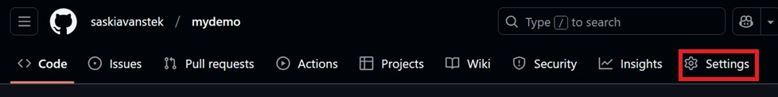
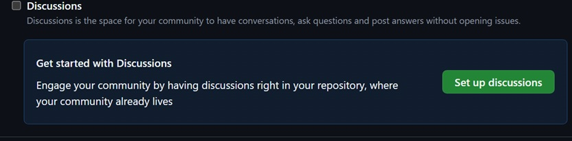
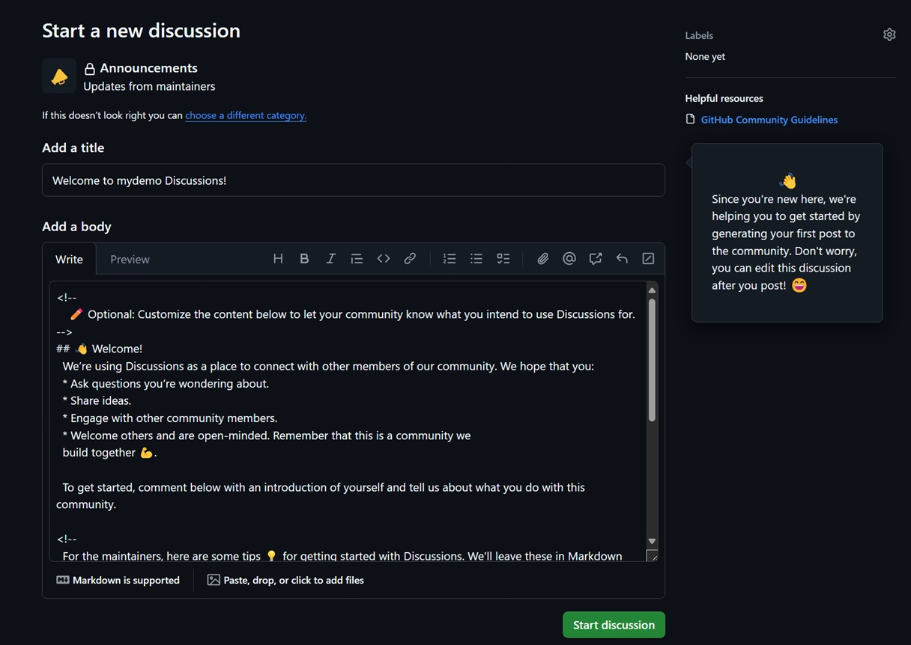
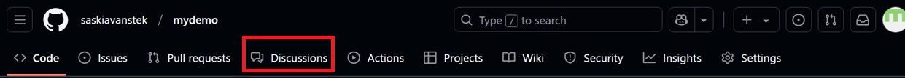
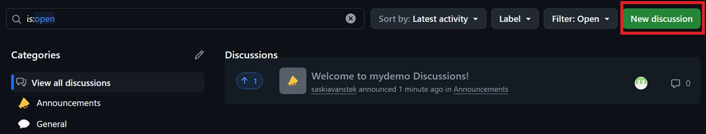
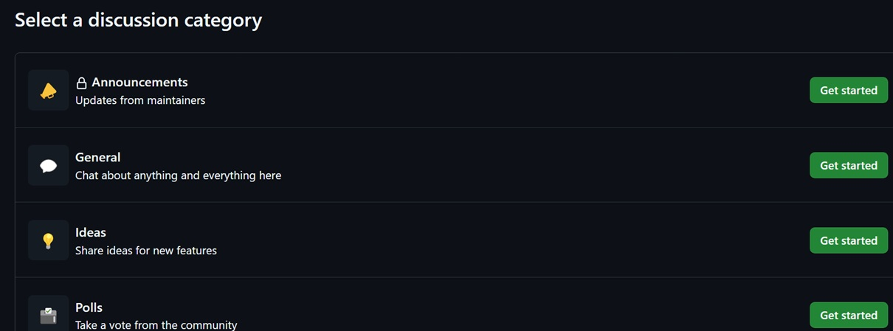
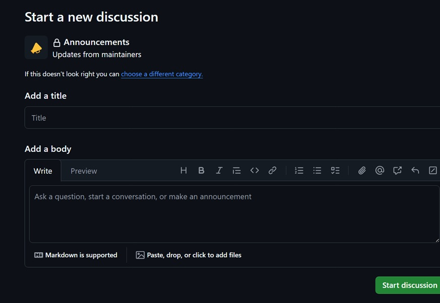

# Enabling a discussion in your repository

>[!TIP]
>Repository owners and people with Write access can enable GitHub Discussions for a community on their public and private repositories.
>The visibility of a discussion is inherited from the repository the discussion is created in.
>When you first enable GitHub Discussions, you're invited to configure a welcome post.

1. On GitHub, navigate to to main page of the repository
2. Under your repository name, select **Settings**

4. Scroll down to the **Features** section under **Discussions**, select **Setup discussions**

6. Under **Start a new discussion**, edit the template to align with the resources and tone you want to set for your community

8. Select **Start discussion**

## Create a new discussion

>[!TIP]
>Any Authenticated user who can view the repository can create a discussion in that repository.
>Similarly, since organization discussions are based on a source repository, any authenticated user who can view the source repository can create a discussion in that organization.

1. On GitHub, naviate to the main page of the repository or organization where you want to start the discussion.
2. Under your repository or organization name, select **Discussions**

4. On the right side of the page, select **New Discussion**

6. Select a discussion category by selecting **Getting started**.

>[!NOTE]
>All discussions must be created in a category.
>For repository discussions, people with maintain or admin permissions to the repository define the categories for discussions in that repository.

>[!TIP]
>Each category must have a unique name, emoij pairing, and a detailed description stating its purpose.
>Categories help maintainers organize how conversations are filed.
>They're customizable to help distinguish categories that er Q&A or more open-ended conversations.
>The following table shows the default categories for discussions and there purpose.

| Category | Purpose |Format|
| ------------- | ------------- |------------- |
| 📣 Announcements  | 	Updates and news from project maintainers |Announcement|
| #️⃣ General | 	Anything and everything relevant to the project |Open-ended discussion|
| 💡 Ideas | 	Ideas to change or improve the project |Open-ended discussion|
| 🗳️ Polls | 		Polls with multiple options for the community to vote for and discuss|Polls|
|🙏 Q&A | 	Questions for the community to answer, with a question/answer format|Question and Answer|
| 🙌 Show and tell | Creations, experiments, or tests relevant to the project|Open-ended discussion|

1. Under **Discussion title** enter a title for your discussion, under **Write** enter the body of your discussion

3. Select **Start Discussion**
 
